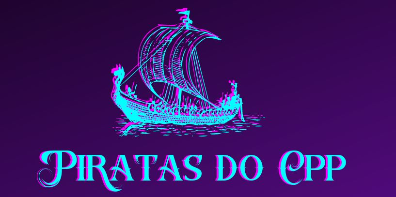
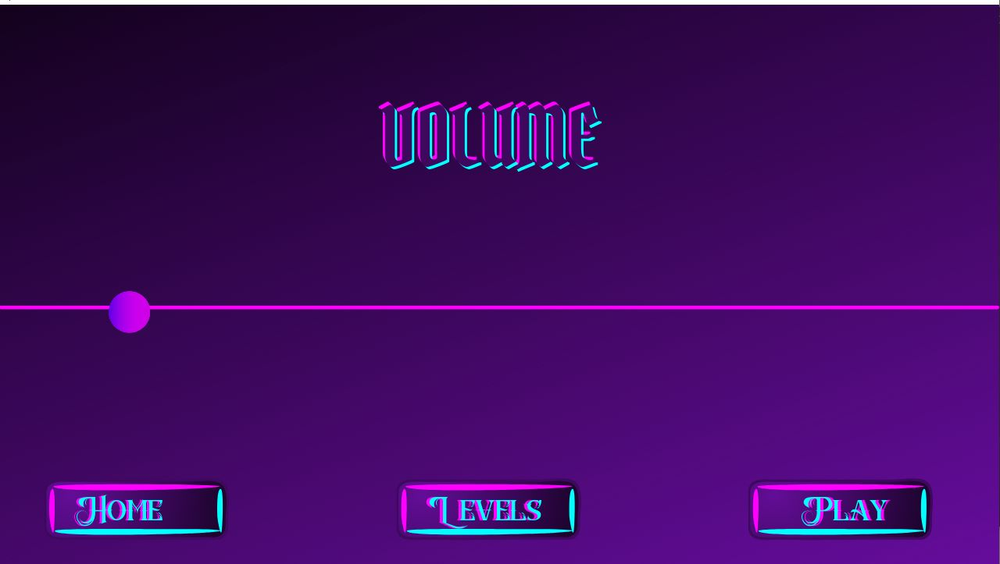
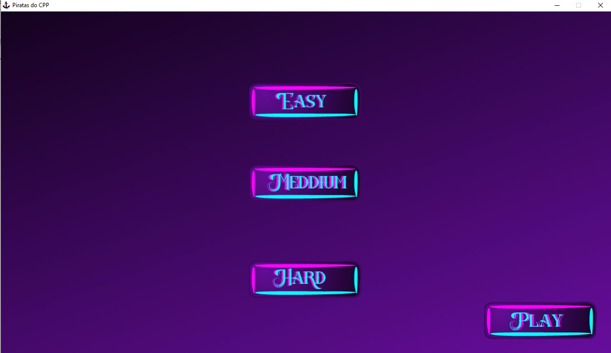
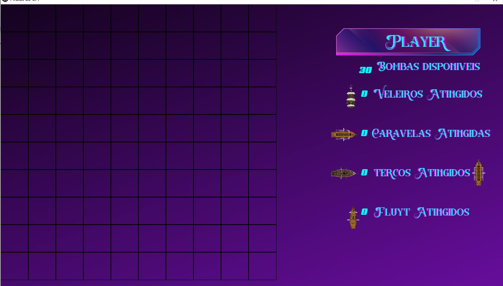

# Piratas do CPP 



Batalha Naval Desenvolvido na linguagem C

## Indice 
- <a href="#-">Contextualização do Projeto</a>
- <a href="#-tecnologias">Principal Tecnologia Destacada</a>
- <a href="#-">Demonstração</a>
- <a href="#-">Como Rodar?</a>
- <a href="#-">Autores</a>

## Contextualização do Projeto ⛵
O presente projeto "Piratas do CPP" consiste num jogo simplificado de batalha naval, onde é criado uma grade/matriz de tamanho 10x10 que é denominado como o cenário do jogo. 
Na grade é colocado barcos invisíveis ao jogador. Seu intuito é enduzir o usuário a achar todos os barcos gerados através do clique, buscando racionalizar as bombas presentes em cada nível de dificuldade para alcançar o objetivo.


## Principal Tecnologia Destacada ⛵
-  [SFML lib](https://www.sfml-dev.org/index.php) 

A presente biblioteca "Simple and Fast Multimedia Library (SFML)" foi responsável por introduiz a parte gráfica no desenvolvimento do jogo, possibilitando assim, a interação visual do usuário, dispensando o uso do terminal.

## Desmonstração ⛵

O menu principal do jogo contem duas opções, de configurações e de play, para ir diretamente pro jogo com as definições padrões.



A tela de configurações permite ao usuário o controle e ajuste do som do jogo, uma alternativa de volta para o menu, acesso aos leveis do jogo e o play.


Os leveis são responsáveis para definir a forma como o usuário quer jogar, sendo fácil = infinitas bombas, medium = 50 e por fim, hard = 35 bombas.


A tela game representa a matriz, denominada com cenário do jogo. Ao lado há a contabilidade de bombas e barcos destruídos


A tela final permite ao usúario jogar novamente, ou sair do jogo, isto é, fechar a tela.


## Como Rodar? ⛵
Diante do exposto, foi ultilizado a biblioteca SFML para a construção do jogo, e para rodar, é preciso utilizar a versão correta em função do seu compilador minGW instalado, caso não tenha instalado, obtenha o <a href="https://sourceforge.net/projects/mingw-w64/files/Toolchains%20targetting%20Win32/Personal%20Builds/mingw-builds/7.3.0/">MinGW</a>.

1. Ao instalar o mingw, abra seu terminal e use o comando: "g++ -v" para verficar se o compilador está instalado.

2. adicione nas variaveis do sistema o PATH do compilador mingw, o caminho por padrão é: \mingw64\bin

3. O jogo foi desenvolvido no <a href="https://www.eclipse.org/">Eclipse IDE</a>, recomendamos utilizá-lo para compilar e rodar seu código, caso utilize outra IDE, certifique-se que a Biblioteca SFML esteja incluida da maneira correta.

4. Abra a pasta gerada após o download do projeto como workspace, acesse a pasta "Piratas_do_CPP" onde se encontra os arquivos .cpp e .hpp e compile o "game.cpp".

Segue o codigo abaixo como exemplo para compilar usando a linha de comando, nao esqueça de indicar o diretório da biblioteca

```c++
g++ -Wall src/main.cpp -I include -o bin/app -L lib/SFML-7.3.0 -lsfml-system -lsfml-window -lsfml-graphics
```

4. Ao compilar, será gerado um executável com o nome "Piratas_do_CPP.exe" na pasta Debug. Execute o para rodar o jogo.


## Autores⛵
Desenvolvido visando a didática, responsável pela instituição CEFET-MG, 12/04/2023

### Alunos Presentes: 

Gabriel Agostinho da Silva
gabrielagostinhodasilva@hotmail.com


Isaque de Sousa Almeida
senhaisaque@gmail.com


Isabelle Tavares Mol Araujo
isabelle.tavares.mol13@gmail.com
